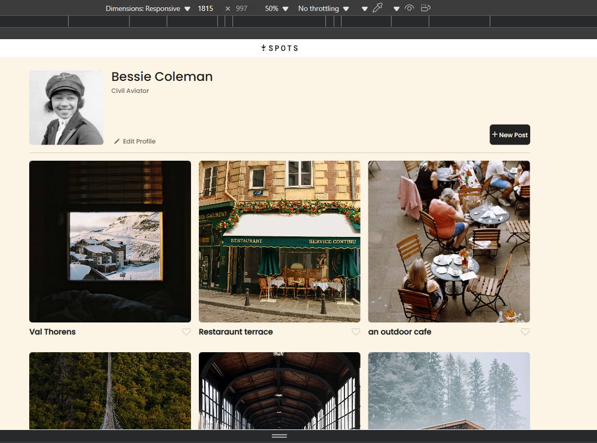
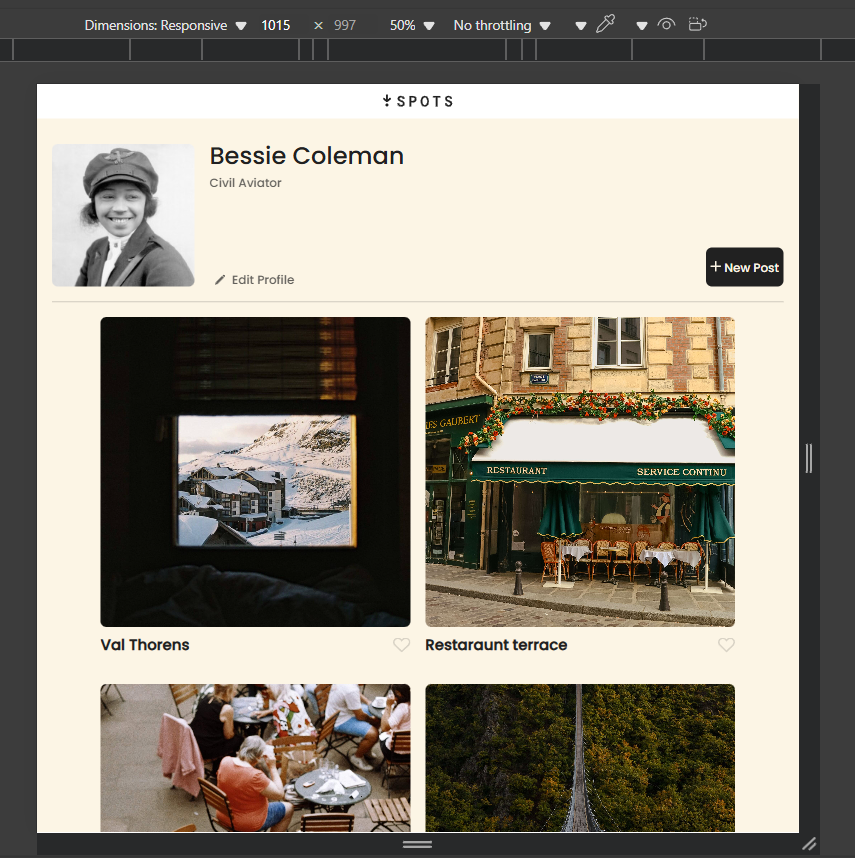
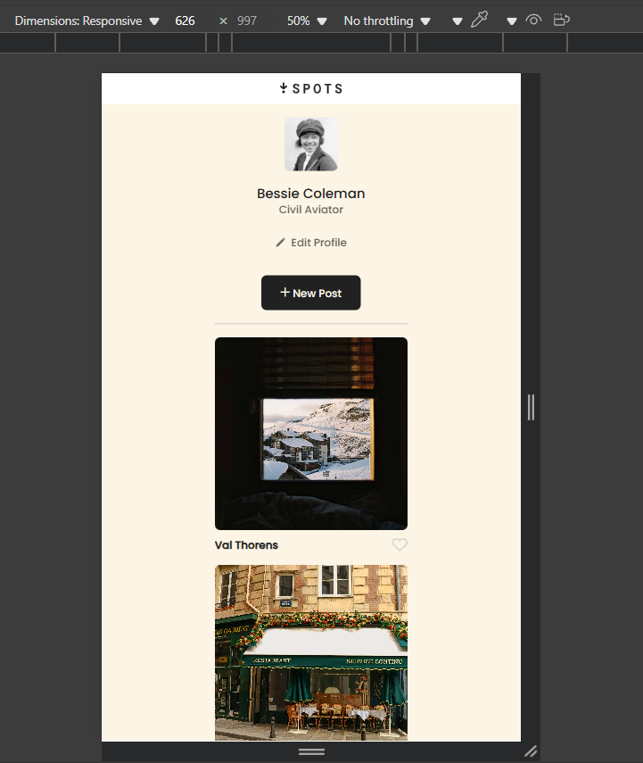

# Project 3: Spots
overview video - 

**Overview**
Video - 

Images 

  
**Intro**
  
This project is made so all the elements are displayed correctly on popular screen sizes. We recommend investing more time in completing this project, since it's more difficult than previous ones. The website is a picture gallery for a individuals profile.  
  
**Tools**
HTML
CSS
Responsive Design

**Figma**  
  
* [Link to the project on Figma](https://www.figma.com/file/BBNm2bC3lj8QQMHlnqRsga/Sprint-3-Project-%E2%80%94-Spots?type=design&node-id=2%3A60&mode=design&t=afgNFybdorZO6cQo-1)
  
**Deployment**
https://sephrixevonaut.github.io/se_project_spots/